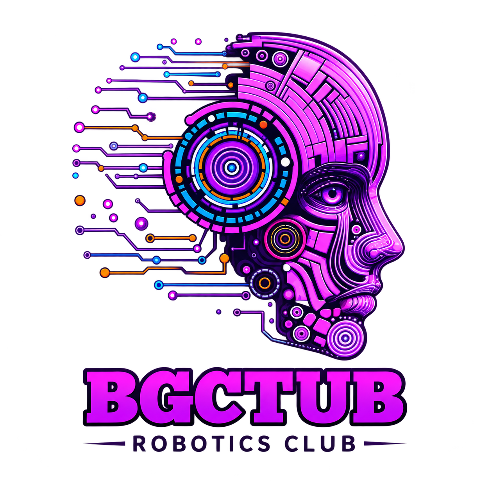

# 🤖 BGCTUB Robotics Club – Member Registration Form & Receipt System

<div align="center">
  
  <br/>
  <h3><b>BGC Trust University Bangladesh Robotics Club</b></h3>
  <p><i>"Learn. Innovate. Compete. Lead."</i></p>

  [](LICENSE)
  [](#)
  [](#)
  [](#)
  [](#)
</div>

---

## 📌 Overview

**BGCTUB Robotics Club Registration Form** is an interactive, printable A4-ready registration system designed with a modern cyberpunk/sci-fi aesthetic. It provides a seamless way to collect member details and automatically includes an official tear-off receipt with executive signatures, club vision/mission, and QR codes for instant community onboarding.

---

## ✨ Features

- **🚀 Futuristic Cyberpunk UI:** Custom neon gradients, hex grids, dynamic circuit board SVG corners, and binary watermarks.
- **📄 All-in-One Dual Section Layout (A4 Form Factor):**
  - **Section 1: Registration Form**
    - Member Name, Student ID, Semester (1st to 8th)
    - WhatsApp Contact Number, Gender Selection
    - Relevant Experience & Skills, Applicant Signature
  - **Section 2: Member Registration Receipt / Token**
    - Detachable section with standard cut guide (`✂ — CUT HERE —`)
    - **QR Codes** for instant access to official **Facebook & WhatsApp Groups**
    - Pre-embedded signatures of Club Executives
    - Club Vision & Mission statements
- **🖨️ Precision Print / PDF Ready:**
  - Standardized exact A4 dimensions (`210mm x 297mm`)
  - One-click **Print / Save as PDF** button with automatic print-media styling (cleans up control buttons and handles exact color rendering)
- **⚡ Zero Dependencies:** Pure HTML5, CSS3, and lightweight vanilla JS. Offline friendly and runs in any modern browser without installation.

---

## 📂 Project Structure

```plaintext
ROBOFORM/
├── BGCTUB_Robotics_Logo01.png       # Official club logo
├── Facebook_QR.jpeg                 # QR code for official Facebook Group
├── WhatsApp_QR.jpeg                 # QR code for official WhatsApp Community
├── ahad_sign.png                    # Signature - President
├── tareq_sign.png                   # Signature - Vice President
├── mainul_sign.png                  # Signature - General Secretary
├── bgctub_registration_form_v3.html # Latest interactive registration & receipt template
├── bgctub_registration_form_v2.html # Previous version backup
└── README.md                        # Documentation
```

---

## 🚀 Getting Started

### 1. Clone the Repository
```bash
git clone https://github.com/TahmidulAhad/BGCTUB-Robotics-Club-Form.git
cd BGCTUB-Robotics-Club-Form
```

### 2. Open in Browser
Simply open `bgctub_registration_form_v3.html` directly in any web browser (Chrome, Edge, Firefox, Brave):

- **Windows:** Double-click `bgctub_registration_form_v3.html` or run:
  ```powershell
  start bgctub_registration_form_v3.html
  ```
- **macOS / Linux:**
  ```bash
  open bgctub_registration_form_v3.html   # macOS
  xdg-open bgctub_registration_form_v3.html # Linux
  ```

---

## 🖨️ Printing & PDF Export Guide

To ensure optimal layout quality when printing or saving as a PDF:

1. Click the **⚙ PRINT / SAVE AS PDF** button at the bottom of the page (or press `Ctrl + P` / `Cmd + P`).
2. Set the print dialog settings:
   - **Destination:** `Save as PDF` or select your physical printer
   - **Paper size:** `A4`
   - **Layout:** `Portrait`
   - **Margins:** `None` (or `Default`)
   - **Scale:** `100%`
   - **Options:** Check **"Background graphics"** (Required for neon gradients and circuit graphics)

---

## 👥 Club Executives & Verification

| Role | Name | Signature Status |
| :--- | :--- | :---: |
| **President** | Md. Tahmidul Alam Ahad | Verified ✅ |
| **Vice President** | Mohammad Tareq Aziz | Verified ✅ |
| **General Secretary** | Md. Mainul Hoque | Verified ✅ |

---

## 🌟 Vision & Mission

- **⚡ Vision:** Learn. Innovate. Compete. Lead.
- **🎯 Mission:** Empowering students to learn through practice, innovate through technology, and create impact through collaboration.

---

## 📄 License

This project is licensed under the [MIT License](LICENSE) – feel free to use, modify, and distribute for club and educational purposes.

---

<div align="center">
  <sub>Developed with ❤️ for <b>BGCTUB Robotics Club</b></sub>
</div>
